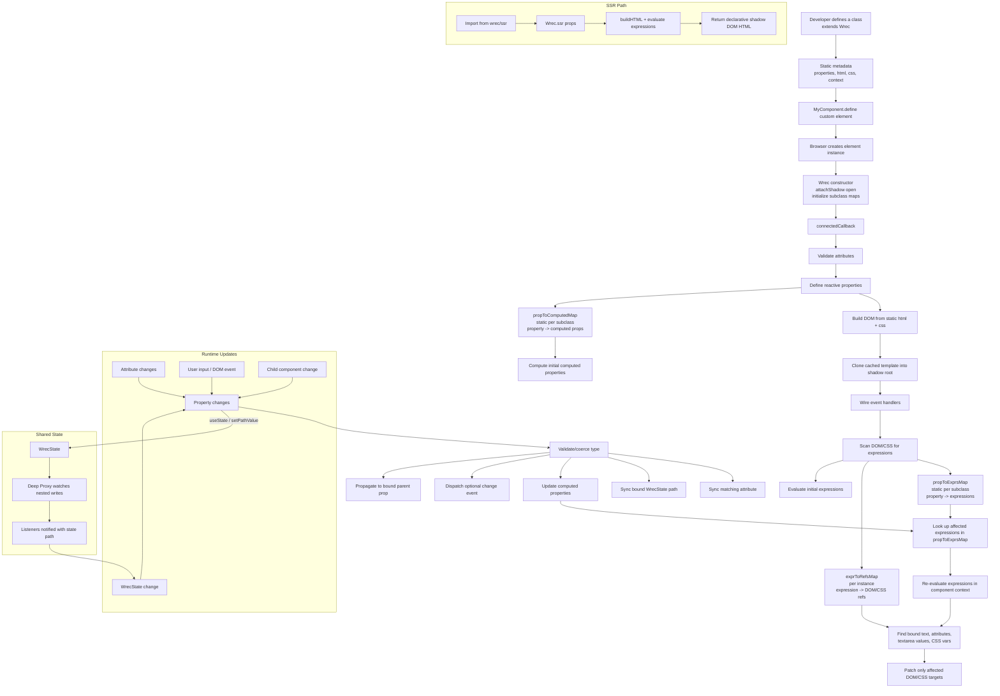

# How wrec Works

This diagram summarizes the runtime flow in `wrec`, based on the logic in
`src/wrec.ts`, `src/wrec-state.ts`, and `src/wrec-ssr.ts`.

## Key Ideas

- `propToExprsMap` is built once per component class and tells `wrec` which
  expressions depend on each property.
- `exprToRefsMap` is built per component instance and tells `wrec` where each
  expression appears in the rendered DOM or CSS.
- When a property changes, `wrec` updates computed properties first, then
  re-evaluates only the expressions affected by that change.
- `WrecState` uses deep proxies plus listener registration so shared state
  changes can update bound component properties.
- If an expression renders HTML, `wrec` sanitizes it before inserting it.
